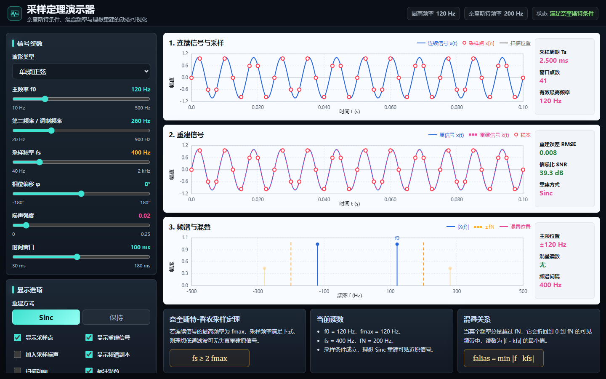

# 采样定理课堂

**Sampling Theorem Classroom** 是一套面向本科《信号与系统》课堂的教学项目，包含 15 分钟课件、讲义、网页互动演示、图片采样实验和音频试听。

[打开在线演示](https://zhengziyuan.github.io/sampling-theorem-classroom/) · [下载 v1.0.1 完整离线包](https://github.com/zhengziyuan/sampling-theorem-classroom/releases/tag/v1.0.1) · [课堂使用指南](docs/classroom-guide.md) · [材料目录](docs/materials.md) · [修改与维护](docs/development.md)



## 快速开始

1. 在 GitHub 点击 **Code → Download ZIP**，下载并解压完整项目。
2. 双击根目录的 **index.html**，打开项目首页。
3. 从首页进入网页演示，或下载课件和讲义。

网页页面、图像和音频均随项目提供，下载后可离线使用。无需安装软件包，也没有外部 CDN、字体服务或数据接口。

如果希望通过本地网页服务打开，在项目目录运行：

```console
python -m http.server 8000
```

然后访问 `http://localhost:8000`。浏览网页不要求 Python，只有这条可选启动方式用到 Python。

## 演示内容

| 演示 | 课堂观察 | 入口 |
| --- | --- | --- |
| 采样、混叠与重建 | 改变采样率、主频和相位，比较 Sinc 插值与零阶保持，观察频谱复制和折回频率 | [网页](demos/sampling-theorem-demo.html) |
| sa / sa² 频谱搬移 | 矩形谱与三角谱、实际支撑边缘、临界采样和频谱副本重叠 | [网页](demos/sa-spectrum-sampling-demo.html) |
| 音频采样率试听 | 44.1 kHz 到 4 kHz 的带宽变化，以及 8 kHz 有无抗混叠滤波的区别 | [网页](demos/audio-sampling-demo.html) |
| 图片采样 | 二维网格、低采样率产生的假纹理，以及预滤波的效果 | [9 页课件](materials/slides/采样定理_图片采样Demo_扩展版.pptx) |
| PowerPoint 内部互动 | 在放映模式点击按钮，调整主频、采样频率、相位和重建方式 | [12 页 PPTM](materials/slides/采样定理_15分钟课堂_含互动演示器.pptm) |

**音频标签表示模拟的采样率。** 现有 WAV 都重建成 44.1 kHz、单声道文件供播放器和 PowerPoint 使用，每段约 10.5 秒。素材为内置合成测试乐句。不能把 WAV 文件头的采样率直接当成实验中被模拟的采样率。

## 课件与讲义

| 材料 | 页数 | 文件 |
| --- | ---: | --- |
| 15 分钟主课件 | 11 | [PPTX](materials/slides/采样定理_15分钟课堂.pptx) |
| 主课件与 PowerPoint 互动演示 | 12 | [PPTM](materials/slides/采样定理_15分钟课堂_含互动演示器.pptm) |
| HTML 演示画面插入版 | 4 | [PPTX](materials/slides/采样定理_HTML演示器_PPT插入版.pptx) |
| 图片采样扩展 Demo | 9 | [PPTX](materials/slides/采样定理_图片采样Demo_扩展版.pptx) |
| 音频采样率播放 Demo | 7 | [PPTX](materials/slides/采样定理_音频采样率播放Demo.pptx) |
| 15 分钟讲义 | 6 | [PDF](materials/handouts/采样定理_15分钟讲义.pdf) · [可编辑 Word](materials/handouts/采样定理_15分钟讲义.docx) |

PPTM 按钮需要支持 VBA 的桌面 PowerPoint，并依赖该软件对文件的信任设置。上课前先试运行最后一页；若当前软件不能运行宏，可以用网页演示完成同样的参数比较。音频课件中的音频已内嵌。

## 15 分钟授课路线

| 时间 | 内容 | 配套操作 |
| --- | --- | --- |
| 0–3 分钟 | 采样与离散序列 | 解释 `x[n] = x(nTs)` 和 `fs = 1/Ts` |
| 3–6 分钟 | 频谱周期复制 | 观察副本之间的间距 |
| 6–9 分钟 | 混叠与折回 | 主频 120 Hz，采样率由 400 Hz 降到 150 Hz |
| 9–12 分钟 | 理想重建 | 比较 Sinc 与零阶保持 |
| 12–15 分钟 | 工程规则与小测 | 抗混叠滤波和音频试听 |

原材料使用常见的 `fs ≥ 2B` 课堂表述。**临界等号需要说明信号类别与频谱边界条件。** 例如对相位为零的 `sin(2πBt)`，按 `fs = 2B` 采样会得到全零序列，不能据此恢复该正弦。实际工程应留过渡带和采样率余量。网页的有限窗口 Sinc 实现也会有截断误差，详见[课堂使用指南](docs/classroom-guide.md)。

## 项目结构

```text
sampling-theorem-classroom/
├── index.html                 项目首页，可离线打开
├── demos/                     三个网页演示
├── materials/
│   ├── slides/                原始 PPTX / PPTM
│   ├── handouts/              原始 PDF / DOCX
│   └── manifest.json          原材料 SHA-256 与课件页数
├── assets/
│   ├── audio/                 WAV、音频图表及相对路径元数据
│   ├── ppt/                   三张 1920×1080 插入图
│   ├── figures/               原讲义图示
│   ├── screenshots/           项目展示预览
│   └── site.css               首页和音频页样式
├── docs/                      使用指南、材料目录、维护说明
├── tools/
│   ├── audio/                 音频素材与音频 PPT 重生成工具
│   ├── powerpoint/            可检查的互动演示 VBA 源码
│   ├── verify_project.py      链接、文件完整性、音频和 Office 包检查
│   └── export_site.py         导出 GitHub Pages 网站
└── .github/workflows/         上传后的检查与网站部署
```

## 检查与修改

检查项目完整性只需要 Python 标准库：

```console
python tools/verify_project.py
```

正常使用不需要重新生成文件。若要替换试听素材，先阅读[维护说明](docs/development.md)。仓库保留原始 Office 文件和两个原始 HTML 演示的字节内容。辅助脚本与音频元数据改为项目相对路径。

## 作者与使用

维护者：[zhengziyuan](https://github.com/zhengziyuan)。当前项目尚未指定开放许可证。复用、修改或再分发材料的授权请联系作者，素材说明见 [NOTICE.md](NOTICE.md)。
